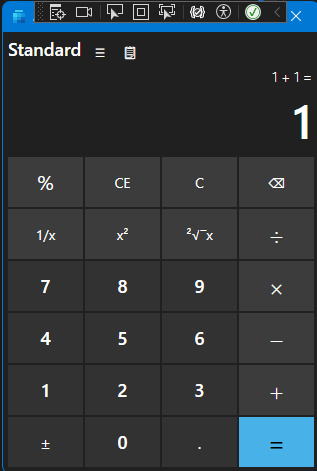

# Windows Calculator But it's Always One Off
This based on lnxwizard's [dotNETCalculator](https://github.com/lnxwizard/dotNETCalculator) because I gave up digging through Microsoft's source code for theirs.

Check out my [YouTube Channel](https://youtube.com/@TheChaoticProgrammer)!
This calculator was an idea by Preposterous Pineapple Person commented on my YouTube Channel
